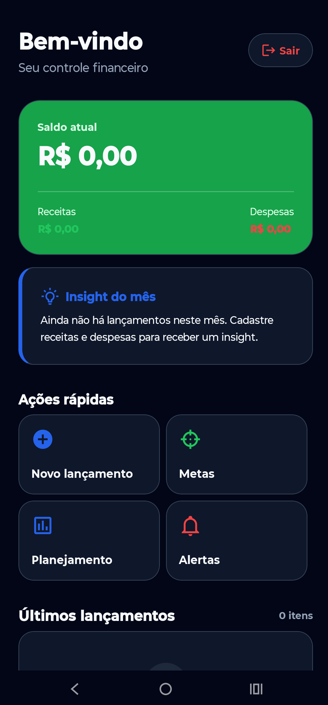
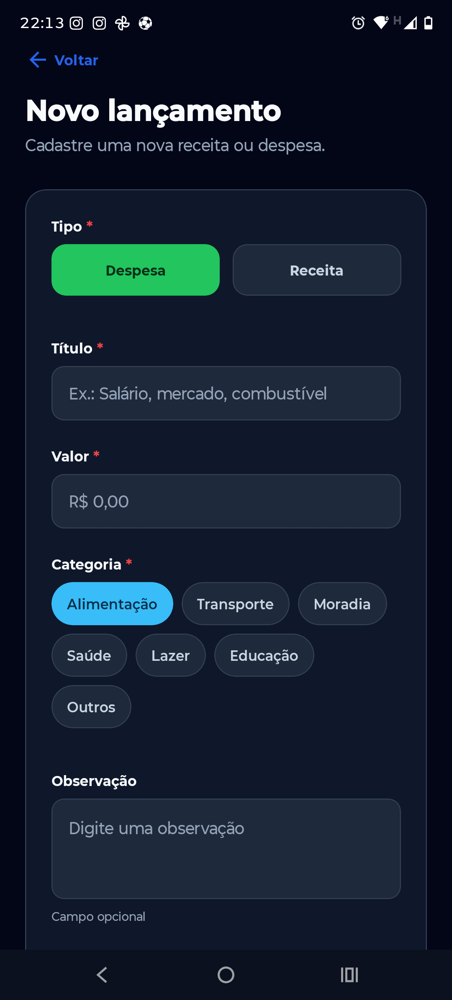
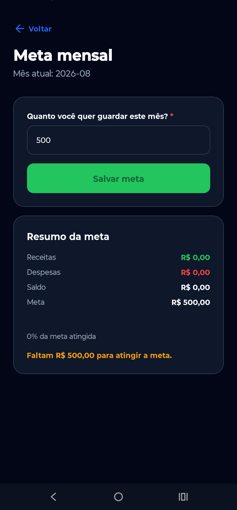
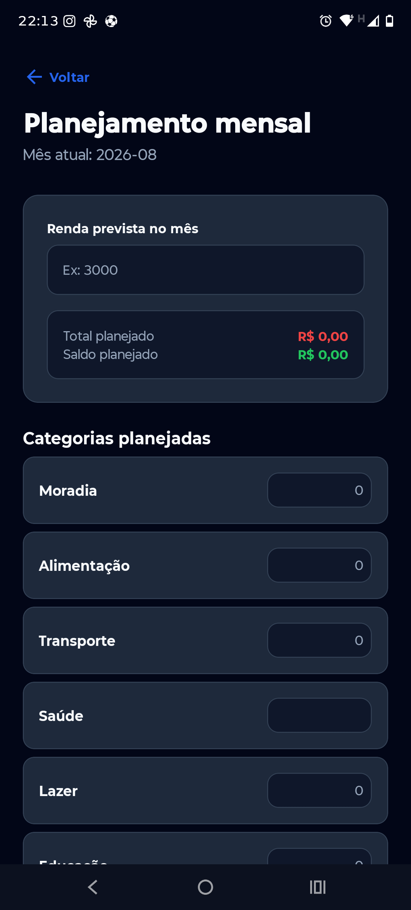

# 💰 FinanControl

Aplicação de **controle financeiro pessoal** desenvolvida com React Native, Expo e TypeScript.

O FinanControl permite registrar receitas e despesas, acompanhar o saldo, criar metas financeiras, planejar gastos mensais e configurar alertas para manter o controle das finanças.

---

## 📱 Preview

<p align="center">
  
  
  
</p>

<p align="center">
  <strong>Home</strong>
  &nbsp;&nbsp;&nbsp;&nbsp;&nbsp;&nbsp;
  <strong>Novo lançamento</strong>
  &nbsp;&nbsp;&nbsp;&nbsp;&nbsp;&nbsp;
  <strong>Meta mensal</strong>
</p>

<p align="center">
  
  </p>

<p align="center">
  <strong>Planejamento mensal</strong>
  &nbsp;&nbsp;&nbsp;&nbsp;&nbsp;&nbsp;
  </p>

---

## 🚀 Funcionalidades

- 🔐 Cadastro, login e controle de sessão
- 💰 Cadastro de receitas e despesas
- ✏️ Edição e exclusão de lançamentos
- 📊 Resumo de receitas, despesas e saldo
- 🎯 Criação e acompanhamento de metas mensais
- 📅 Planejamento de gastos por categoria
- 💡 Insights financeiros
- 🔔 Alertas automáticos

---

## 🛠️ Tecnologias

- React Native
- Expo SDK 54
- TypeScript
- Expo Router
- React Hooks
- Context API
- Axios
- REST API
- Async Storage
- Expo Notifications
- EAS Build
- Git e GitHub

---

## 🧱 Organização do projeto

O projeto foi estruturado separando as responsabilidades entre telas, componentes reutilizáveis, hooks, services e utilitários.

```text
app/
├── home.tsx
├── goals.tsx
├── monthly-plan.tsx
├── notifications.tsx
├── new-transaction.tsx
└── transactions/

src/
├── components/
├── hooks/
├── services/
├── storage/
├── theme/
├── types/
└── utils/
```

A aplicação segue, de forma simplificada, o seguinte fluxo:

```text
Screen → Custom Hook → Service → REST API
```

Essa organização facilita a manutenção, reutilização de código e evolução do projeto.

---

## ⚙️ Como executar

### Pré-requisitos

- Node.js
- npm
- Git

### Clone o repositório

```bash
git clone https://github.com/FellipeBordin/controle-financeiro-front-end
```

### Entre na pasta do projeto

```bash
cd controle-financeiro-front-end
```

### Instale as dependências

```bash
npm install
```

### Inicie o projeto

```bash
npx expo start
```

## 🌐 Aplicação online

Acesse o FinanControl:

https://financontrol-five.vercel.app

### Verificações

TypeScript:

```bash
npx tsc --noEmit
```

Lint:

```bash
npx expo lint
```

---

## 👨‍💻 Autor

**Fellipe Bordin**

Projeto desenvolvido para estudo e portfólio, aplicando conhecimentos em **React Native, TypeScript, integração com APIs REST, componentização e organização de código**.

---

## 📄 Licença

Este projeto foi desenvolvido para fins de estudo e portfólio.
